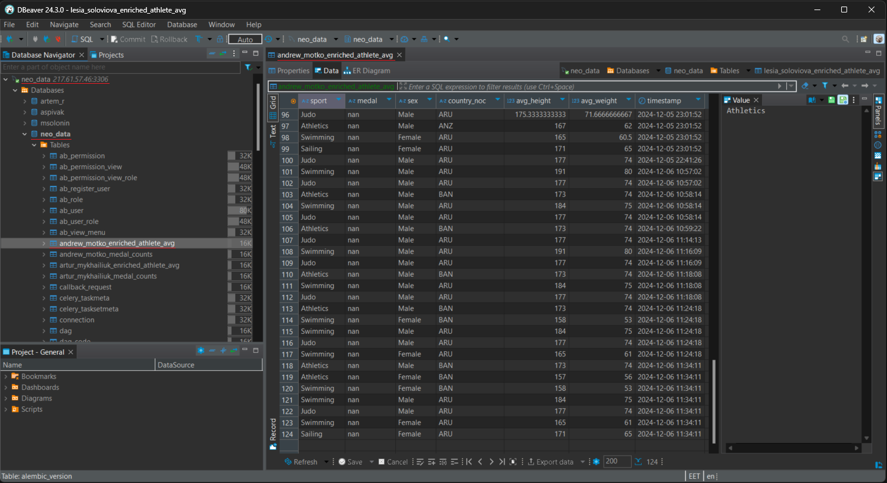
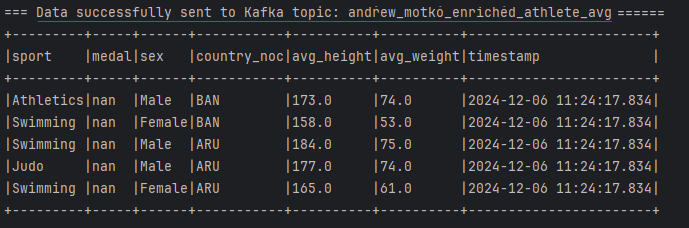
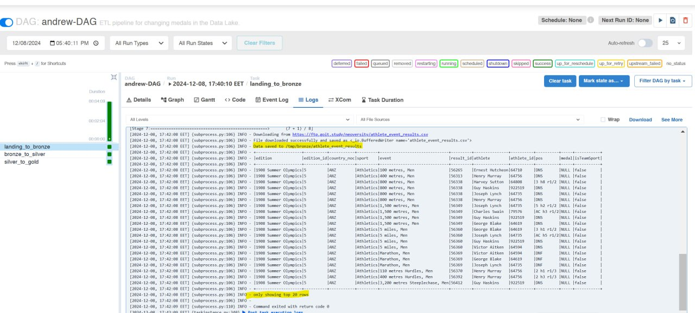
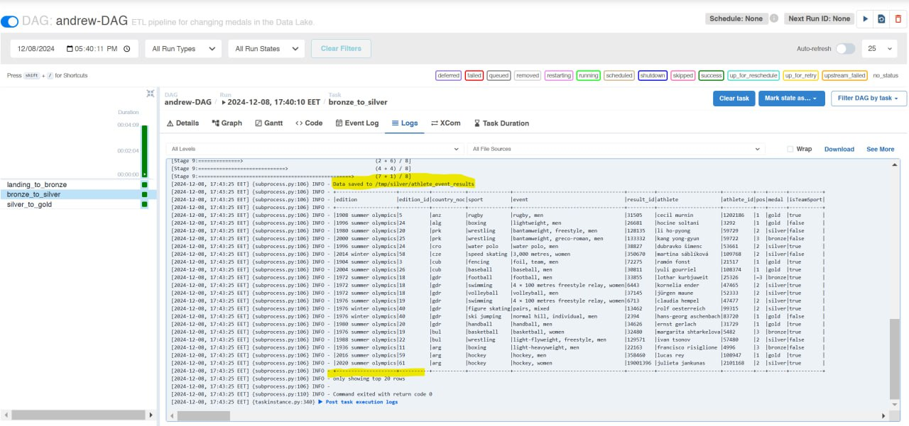
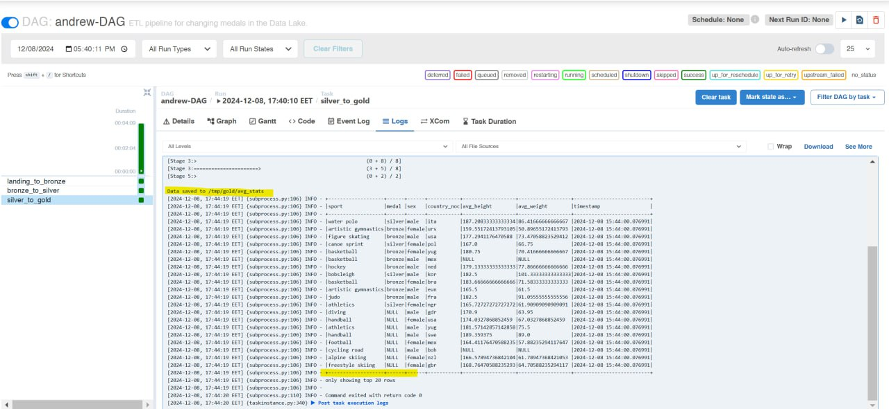
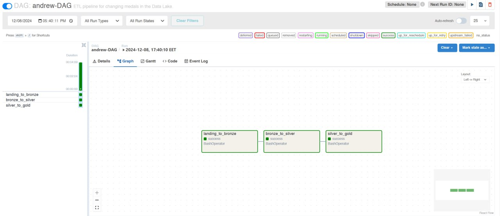

# Data Engineering Course Final Project Solution

## Part 1: Building an End-to-End Streaming Pipeline

**This screenshot shows the result of inserting data into the enriched_athlete_avg table.**

\***\*The screenshot confirms the data was recorded in the Kafka topic 'andrew_motko_enriched_athlete_avg'.**

## Part 2: Building an End-to-End Batch Data Lake

**The result of displaying the saved data in the bronze/athlete_event_results table**

**The result of displaying the saved data in the silver/athlete_event_results table**

**The result of displaying the saved data in the gold/avg_stats table**

**This screenshot shows a DAG with three successfully executed batches.**

